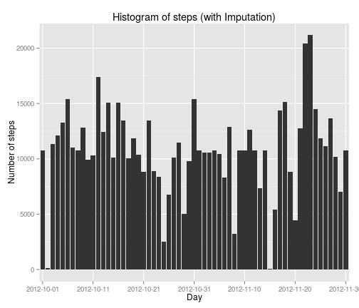
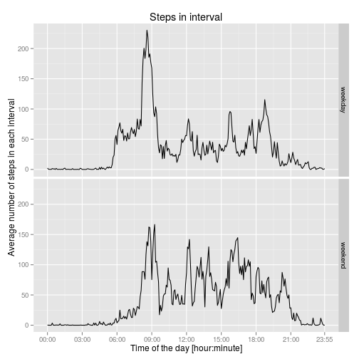

**Please take heed to the bold notes! The gaps in the first graph are intentionally there and correct!**

# Reproducible Research: Peer Assessment 1

## Loading and preprocessing the data

Load libraries, set system language:


```r
library(knitr)
library(ggplot2)
library(plyr)
library(lattice)
Sys.setlocale("LC_TIME", "en_US.UTF-8")
```

```
## [1] "en_US.UTF-8"
```

*Show any code that is needed to*

*1. Load the data (i.e. read.csv())*


```r
unzip("activity.zip")
activity <- read.csv(unzip("activity.zip", list = TRUE)$Name)
```

*2. Process/transform the data (if necessary) into a format suitable for your analysis*


```r
activity$steps <- as.numeric(activity$steps)
activity$date <- as.factor(activity$date)
#activity$interval <- as.factor(activity$interval)
activity$time <- as.factor(paste( sprintf("%02i", activity$interval %/% 100), ":", sprintf("%02i", activity$interval %% 100), sep=""))
```

## What is mean total number of steps taken per day?

*For this part of the assignment, you can ignore the missing values in the dataset.*

*1. Make a histogram of the total number of steps taken each day*

**Note: There are gaps for some days. That is actually correct! At some days no steps were recorded! (To fill these gaps is a task later on.)**


```r
dailySteps <- with(na.omit(activity), aggregate(steps, by=list(date=date), FUN=sum))
names(dailySteps) <- revalue(names(dailySteps), c("x"="steps"))

g1 <- ggplot(dailySteps, aes(x=as.factor(date),y=steps))
g1 <- g1 + geom_bar(stat="identity", position="dodge")
g1 <- g1 + labs(title="Histogram of steps", x="Day", y="Number of steps")
g1 <- g1 + scale_x_discrete(limits=levels(dailySteps$date), breaks=levels(dailySteps$date)[seq(1,61,10)] )
print(g1)
```

 

*2. Calculate and report the mean and median total number of steps taken per day*


```r
mean(dailySteps$steps, na.rm = TRUE)
```

```
## [1] 10766
```

```r
median(dailySteps$steps, na.rm = TRUE)
```

```
## [1] 10765
```

## What is the average daily activity pattern?

*1. Make a time series plot (i.e. type = "l") of the 5-minute interval (x-axis) and the average number of steps taken, averaged across all days (y-axis)*

**Note:**


```r
intervalSteps  <- with(na.omit(activity), aggregate(steps, by=list(time=time), FUN=mean))
names(intervalSteps) <- revalue(names(intervalSteps), c("x"="steps"))

g2 <- ggplot(intervalSteps, aes(x=1:288,y=steps))
g2 <- g2 + geom_line()
g2 <- g2 + labs(title="Steps in interval", x="Time of the day [hour:minute]", y="Average number of steps in each interval")
g2 <- g2 + scale_x_continuous(limits=c(1,288), breaks=c(seq(1,288,36),288), labels=levels(intervalSteps$time)[c(seq(1,288,36),length(levels(intervalSteps$time)))] )
print(g2)
```

 

*2. Which 5-minute interval, on average across all the days in the dataset, contains the maximum number of steps?*


```r
as.character(intervalSteps$time[which.max(intervalSteps$steps)])
```

```
## [1] "08:35"
```

## Imputing missing values

*Note that there are a number of days/intervals where there are missing values (coded as NA). The presence of missing days may introduce bias into some calculations or summaries of the data.*

*1. Calculate and report the total number of missing values in the dataset (i.e. the total number of rows with NAs)*


```r
sum(!complete.cases(activity))
```

```
## [1] 2304
```

*2. Devise a strategy for filling in all of the missing values in the dataset. The strategy does not need to be sophisticated. For example, you could use the mean/median for that day, or the mean for that 5-minute interval, etc.*

*3. Create a new dataset that is equal to the original dataset but with the missing data filled in.*


```r
activityNoNA <- activity

activityNoNA$steps[is.na(activity$steps)] <- intervalSteps$steps[match(activity$time[is.na(activity$steps)], intervalSteps$time)]

## Last Line in detail:
# activity_NA_bools <- is.na(activity$steps)
# times_when_activity_is_NA <- activity$time[activity_NA_bools]
# vect_position_in_vect_of_interval_averages_where_activity_is_NA <- match(times_when_activity_is_NA, intervalSteps$time)
# activityNoNA$steps[activity_NA_bools] <- intervalSteps$steps[vect_position_in_vect_of_interval_averages_where_activity_is_NA]
```

*4. Make a histogram of the total number of steps taken each day*

**Note: There are NO gaps anymore. Behold the Imputation! ;-)**


```r
dailyStepsNoNA <- with(activityNoNA, aggregate(steps, by=list(date=date), FUN=sum))
names(dailyStepsNoNA) <- revalue(names(dailyStepsNoNA), c("x"="steps"))

g3 <- ggplot(dailyStepsNoNA, aes(x=as.factor(date),y=steps))
g3 <- g3 + geom_bar(stat="identity", position="dodge")
g3 <- g3 + labs(title="Histogram of steps (with Imputation)", x="Day", y="Number of steps")
g3 <- g3 + scale_x_discrete(limits=levels(dailyStepsNoNA$date), breaks=levels(dailyStepsNoNA$date)[seq(1,61,10)] )
print(g3)
```

 

*and Calculate and report the mean and median total number of steps taken per day.*


```r
mean(dailyStepsNoNA$steps)
```

```
## [1] 10766
```

```r
median(dailyStepsNoNA$steps)
```

```
## [1] 10766
```

*Do these values differ from the estimates from the first part of the assignment?*

Obviously only the median changed a little.

*What is the impact of imputing missing data on the estimates of the total daily number of steps?*

There is hardly an impact: the mean did not change - also my median hardly changed. This is due to the nature of this specific imputation.

## Are there differences in activity patterns between weekdays and weekends?

*For this part the weekdays() function may be of some help here. Use the dataset with the filled-in missing values for this part.*

*1. Create a new factor variable in the dataset with two levels – “weekday” and “weekend” indicating whether a given date is a weekday or weekend day.*


```r
activityNoNA$daytype <- as.factor(ifelse(  weekdays.POSIXt(as.POSIXlt(activityNoNA$date)) %in% c("Saturday","Sunday")  ,  "weekend"  ,  "weekday"  ))
intervalStepsNoNA <- with(activityNoNA, aggregate(steps, by=list(time=time,daytype=daytype), FUN=mean))
names(intervalStepsNoNA) <- revalue(names(intervalStepsNoNA), c("x"="steps"))
```

*2. Make a panel plot containing a time series plot (i.e. type = "l") of the 5-minute interval (x-axis) and the average number of steps taken, averaged across all weekday days or weekend days (y-axis). The plot should look something like the following, which was creating using simulated data:*


```r
g4 <- ggplot(intervalStepsNoNA, aes(x=as.numeric(time),y=steps))
g4 <- g4 + facet_grid(daytype~.)
g4 <- g4 + geom_line()
g4 <- g4 + labs(title="Steps in interval", x="Time of the day [hour:minute]", y="Average number of steps in each interval")
g4 <- g4 + scale_x_continuous(limits=c(1,288), breaks=c(seq(1,288,36),288), labels=levels(intervalSteps$time)[c(seq(1,288,36),length(levels(intervalSteps$time)))] )
print(g4)
```

 

```r
# Alternative:
# xyplot(steps ~ time | daytype, intervalStepsNoNA, type="l", layout=c(1,2), xlab="Interval", ylab="Number of steps")

# Old Code that does not work:
# g4 <- ggplot(intervalStepsNoNA )
# g4 <- g4 + facet_grid(daytype~.)
# g4 <- g4 + geom_line(aes(x=as.factor(time),y=steps))
# g4 <- g4 + labs(title="Steps in interval", x="Interval", y="Number of steps")
# print(g4)
```

